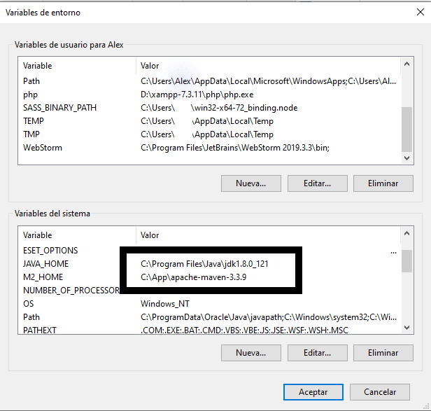
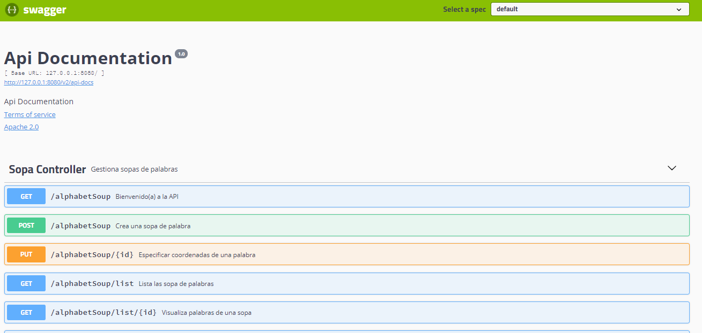

# Ejemplo de sopa de palabra + API para interactuar con la sopa + Swagger + JavaDoc para la documetación

## Descripción
Este es un ejemplo de una sopa de palabras. 

Más que conseguir la perfección y rendimiento del código, sea ha tratado de utilizar varias
estructuras de datos y varios tipo de bucles (ciclos) en la implementación con el objetivo de
abarcar y poner en funcionamiento cada uno. Sin dejar de tener en cuenta el correcto funcionamiento
del ejemplo.

Aclarar que el ejemplo no persiste las sopas en ningún tipo de medio de almacenamiento, ya que no es el 
objetivo del mismo. Simplemente es almacenada temporalmente en memoria durante la ejecución del código.

*   Nota: En el desarrollo de este ejemplo se utilizó Lombok una solución que nos permite evitar tener que escribir
una y otra vez ese código repetitivo (Getters y Setters).

## Funcionamiento
Desde la API se acceden a diferentes EndPoint para la creación y gestión de las sopas de palabras.
(Más adelante en la Interfaz de Swager2 se detallan los mismos).

*   El usuario puede crear sopas de palabras definiendo alto y ancho de la sopa, así como la dirección
de las palabras en la misma. Las direcciones son todos las posibles, 
IZQUIERDA-DERECHA, DERECHA-IZQUIERDA, ARRIBA-ABAJO, ABAJO-ARRIBA Y DIAGONAL (aclarar que la diagonal 
contempla los cuatro sentidos)

*   Se pueden listar las sopas creadas
*   Se puede visualizar la matriz de una sopa de letras
*   Se puede listar las palaras que se encuentran en una sopa
*   Se puede indicar mediante coordenadas inicial y final (siempre empezando por 0) que se ha encontrado
una palabra
*   Se puede listar las palabras encontradas en una sopa
*   Se chequea que las coordenadas entradas por el usuario sean una coordenada válida y dentro de la sopa

## Marco
Para el desarrollo del ejemplo se seleccionó Spring boot (2.2.0) y se utilizó Swagger2 (2.9.2) para la 
documentación de la API.

Fue ejecutado sobre Windows 10 Pro 64-bits y la explicación de puesta en marcha es basada en este sistema, 
aunque perfectamente puede correr en otros sistemas operativos. Para el funcionamiento del mismo es necesario
tener implementado el marco de desarrollo de Java con su JDK, así como la configuración de las variables de 
entorno, tanto de java como las de Maven.


* Para JDK 

1- Descargamos la última versión de la JDK de Java (en mi casi la 1.8.0_121)

2- Seguimos el asistente hasta el final…: siguiente, siguiente, siguiente…

3- Configuramos las variables de entorno de Windows. (Para ello hacemos clic derecho sobre 
Equipo > Propiedades -> Configuración avanzada del sistema -> pestaña Opciones avanzadas -> Variables de entorno)

4- Si todo está bien, al abrir un terminal (cmd.exe) y escribir «java -version» debería mostrar los 
datos de la versión instalada.


*   Para Maven

1-  Accedemos a la página web de Maven y descargamos la última versión. (En mi caso, la 3.3.9).

2-  Descomprimimos el archivo en C:/maven, de modo que todos los archivos de Maven se encontrarán 
en C:/maven/apache-maven-3.3.9 (en mi caso esta en otro directorio)

3- Configuramos la variable de entorno al igual que en el caso anterior (el JDK): 

4- Accedemos a la terminal y escribimos «mvn -v». 

(Aseguraos de que el terminal no estaba abierto 
cuando cambiaste las variables de sesión, porque entonces no reconocerá estas variables. 
Debes de cerrarlo y volverlo a abrir. Si todo está bien nos mostrará la versión de Maven instalada)


*   Instalando Lombok

Desde la web del proyecto Lombok (https://projectlombok.org/download) se puede descargar un jar, que debería 
poder instalarse con un simple doble click. En el caso de que esto no funcionara habría que recurrir a la línea 
de comandos y ejecutar:

```
java -jar lombok.jar
```

## Ejemplos de variables de entorno
<div style="text-align: center; margin: 20px; width: 100%">
     
</div>

## Instalación de dependencias
```
mvn clean install
```

## API expuesta por Swagger2

http://127.0.0.1:8080/swagger-ui.html

<div style="text-align: center; margin: 20px; width: 100%">
     
</div>

